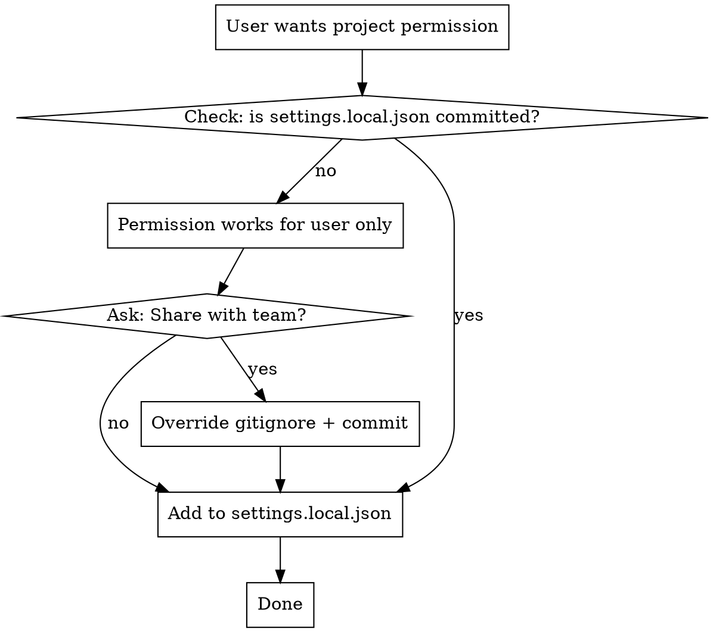

# Configuring Permissions

## Overview

Claude Code permissions control which tools/skills can run without prompting. **Core principle:** prompt grants update memory immediately; manual edits require restart.

## Permission Files

| File                           | Scope         | Committed? | Precedence |
| ------------------------------ | ------------- | ---------- | ---------- |
| `~/.claude/settings.json`      | User (global) | No         | Lowest     |
| `.claude/settings.json`        | Project       | Yes        | Middle     |
| `.claude/settings.local.json`  | Project local | Usually no | Highest    |

## CRITICAL

### Restart Requirement

| Method                    | Restart? | Why                                       |
| ------------------------- | -------- | ----------------------------------------- |
| Prompt grant              | No       | Updates file AND in-memory simultaneously |
| Manual settings.json edit | **Yes**  | File only read at startup                 |

When manually editing `~/.claude/settings.json`, tell user:

> Restart Claude Code for the new permission to take effect.

## Adding Permissions

### Via Prompt (Recommended)

Select "Yes, and don't ask again" → adds to appropriate settings file, no restart needed.

### Via Manual Edit

```json
{
  "permissions": {
    "allow": ["Bash", "Skill(plugin:*)"],
    "deny": []
  }
}
```

## Team-Shared Permissions



**Check if committed:**
```bash
git ls-files .claude/settings.local.json
```

**If not committed, ask user:**

> This permission will only work for you. Want to share it with the team?
>
> This requires overriding gitignore:
> ```gitignore
> .claude/
> !.claude/settings.local.json
> ```

**Motivations for committing:**

1. **Team friction** — new members get permissions automatically
2. **Worktree friction** — worktrees are separate directories, don't inherit uncommitted files

## Worktree Considerations

Git worktrees create separate directory trees. Uncommitted `.claude/settings.local.json` from main worktree is NOT available in new worktrees.

**Solutions:**
1. Commit to repo (team pattern above)
2. Copy manually after worktree creation
3. Automate copying in worktree setup scripts

Warn users relying on local permissions when setting up worktree workflows.

## Permission Patterns

```
Bash                           # All bash commands
Bash(npm run build)            # Specific command
Edit                           # All file edits
Read(~/**)                     # Read files in home
Skill(plugin:*)                # All skills from plugin
Skill(plugin:skill-name)       # Specific skill
mcp__*                         # All MCP tools
mcp__server__*                 # All tools from MCP server
WebFetch(domain:example.com)   # Specific domain
```

## Notes

* `*` matches any characters; `**` matches directory depth
* Deny rules take precedence over allow
* Project settings override user settings
* `Skill(*)` glob not supported in project settings — list individually ([#6881](https://github.com/anthropics/claude-code/issues/6881))
