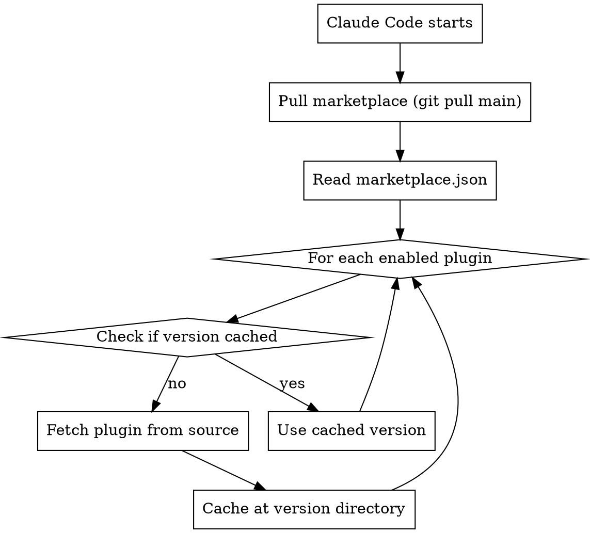

# Managing Marketplaces

## Overview

Plugin marketplaces are catalogs of available plugins. This skill covers how updates work, caching, and versioning.

## Key Locations

| Path | Purpose |
|------|---------|
| `~/.claude/plugins/marketplaces/` | Git clones of remote marketplaces |
| `~/.claude/plugins/cache/<marketplace>/<plugin>/<version>/` | Cached plugin versions |
| `~/.claude/plugins/known_marketplaces.json` | Marketplace registry with update timestamps |

## Update Mechanism

### Marketplace Level (No Version Pin)

Marketplaces track **main branch HEAD** - no commit pinning:

```json
// known_marketplaces.json
{
  "superpowers-marketplace": {
    "source": {
      "source": "git",
      "url": "https://github.com/obra/superpowers-marketplace.git"
    },
    "lastUpdated": "2026-01-09T15:25:06.447Z",
    "autoUpdate": true
  }
}
```

- `autoUpdate: true` pulls latest on startup/refresh
- Local directory marketplaces (`source: "directory"`) read immediately - no push needed

### Plugin Level (Version Pinned)

Plugins ARE versioned via the `version` field in plugin.json:

```
~/.claude/plugins/cache/
├── superpowers-marketplace/
│   └── superpowers/
│       └── 4.0.3/           ← version from plugin.json
└── jasonkuhrt/
    └── diagrams/
        └── 1.0.0/           ← version from plugin.json
```

### Update Flow



## Version Pinning Summary

| Layer | Pinned? | Update Mechanism |
|-------|---------|------------------|
| Marketplace | No (tracks main HEAD) | `autoUpdate: true` or `/plugin marketplace update` |
| Plugin | Yes (version field) | Bump version in plugin.json → new cache dir |

## Commands

```bash
# List known marketplaces
/plugin marketplace list

# Update marketplace metadata
/plugin marketplace update <marketplace-name>

# Add marketplace
/plugin marketplace add owner/repo              # GitHub
/plugin marketplace add ./local-path            # Local
/plugin marketplace add https://url.git         # Git URL

# Remove marketplace (also uninstalls plugins from it)
/plugin marketplace remove <marketplace-name>
```

## Local Development

For local marketplaces (like `jasonkuhrt`):

```json
{
  "jasonkuhrt": {
    "source": {
      "source": "directory",
      "path": "/path/to/marketplace"
    }
  }
}
```

- Changes to marketplace.json are **immediate**
- Changes to plugin.json are **immediate**
- No git operations needed for personal use
- Push to remote for others to receive updates

## Enabling Plugins

In project or user `settings.json`:

```json
{
  "enabledPlugins": {
    "plugin-name@marketplace-name": true
  }
}
```

## Notes

- Removing a marketplace uninstalls all plugins from it
- Multiple versions can coexist in cache (old versions not auto-cleaned)
- `lastUpdated` timestamp tracks when marketplace was last refreshed
