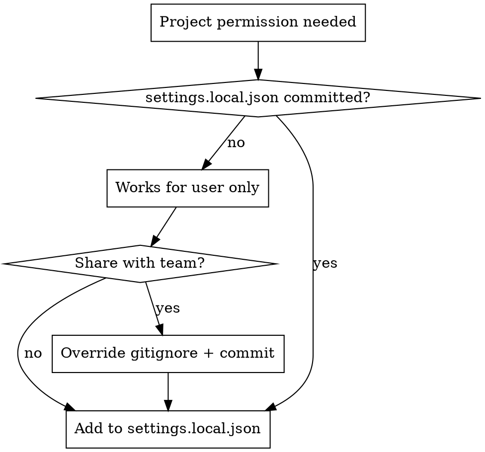

# Configuring Permissions

## STOP: Freshness Check Required

**Before using this skill:** Check `.state` file — if missing or `last_evaluated` > 7 days ago, warn user and research current CC issues before proceeding.

```bash
find ~/.claude/plugins -path "*/claude-code/skills/configuring-permissions/.state" 2>/dev/null | head -1
```

**Full procedure:** [freshness-check.md](freshness-check.md)

---

## Overview

Claude Code permissions control which tools/skills can run without prompting. **Core principle:** prompt grants update memory immediately; manual edits require restart.

## CRITICAL

### Team vs Solo Project Detection

**Before modifying project settings:** Check if changes affect a team (`git shortlog -sne --all | head -10`). User-level `Skill(*)` won't help teammates — team projects need project-level config.

**Full decision flow:** [team-detection.md](team-detection.md)

### Restart Requirement

| Method                    | Restart? | Why                                       |
| ------------------------- | -------- | ----------------------------------------- |
| Prompt grant              | No       | Updates file AND in-memory simultaneously |
| Manual settings.json edit | **Yes**  | File only read at startup                 |

When manually editing settings.json, tell user:

> Restart Claude Code for the new permission to take effect.

### Skill Permission Naming

**Common mistake:** Using marketplace name instead of plugin name.

| Plugin Identifier | Correct Pattern | Wrong Pattern |
|-------------------|-----------------|---------------|
| `claude-code@jasonkuhrt` | `Skill(claude-code:*)` | `Skill(jasonkuhrt:*)` |
| `hookify@claude-plugins-official` | `Skill(hookify:*)` | `Skill(claude-plugins-official:*)` |

The format is `Skill(plugin-name:skill-name)`, NOT `Skill(marketplace-name:skill-name)`.

**To find the correct plugin name:** Look at the part BEFORE the `@` in the plugin identifier.

### MCP Permission Syntax

MCP permissions support three patterns ([docs](https://code.claude.com/docs/en/iam)):

| Pattern | Matches |
|---------|---------|
| `mcp__server` | All tools from server |
| `mcp__server__*` | All tools (wildcard, equivalent) |
| `mcp__server__tool` | Specific tool only |

Example:
```json
{
  "permissions": {
    "allow": [
      "mcp__serena",
      "mcp__claude-in-chrome",
      "mcp__effect-docs"
    ]
  }
}
```

Fully qualified names (e.g., `mcp__serena__find_symbol`) only needed to allow specific tools while denying others from the same server.

**Note:** Issue [#3107](https://github.com/anthropics/claude-code/issues/3107) (July 2025) claimed wildcards weren't supported, but current docs confirm both patterns are valid and equivalent.

### Skill Permissions

**`Skill(*)` is broken everywhere:**
- `~/.claude/settings.json` (user): buggy, sometimes ignored ([#5140](https://github.com/anthropics/claude-code/issues/5140), [#10833](https://github.com/anthropics/claude-code/issues/10833))
- `.claude/settings.json` (project): doesn't work at all
- `.claude/settings.local.json` (project local): works, but see team workaround below

**For individuals:** Use explicit patterns in user settings:
```json
"Skill(plugin-name:*)"
```
Extract plugin names from `enabledPlugins` keys (the part before `@`).

**For teams — Option A (simple, no personal overrides):**
Commit `.claude/settings.local.json` with skill permissions. Tradeoff: team members can't have personal overrides without merge conflicts.

**For teams — Option B (recommended, allows personal overrides):**
Use a SessionStart hook to sync baseline permissions:

1. Create `.claude/settings.local.json.example` (committed) with baseline permissions
2. Keep `.claude/settings.local.json` gitignored
3. Add SessionStart hook to sync example → local:

```bash
#!/bin/bash
# .claude/scripts/sync-local-permissions.sh
EXAMPLE=".claude/settings.local.json.example"
LOCAL=".claude/settings.local.json"

[[ ! -f "$EXAMPLE" ]] && exit 0

if [[ ! -f "$LOCAL" ]]; then
  cp "$EXAMPLE" "$LOCAL"
  echo "Created $LOCAL from example. Restart CC for permissions to take effect."
  exit 0
fi

CURRENT=$(jq -S '.permissions.allow // [] | sort' "$LOCAL" 2>/dev/null || echo '[]')
BASELINE=$(jq -S '.permissions.allow // [] | sort' "$EXAMPLE" 2>/dev/null || echo '[]')
MERGED=$(jq -n --argjson a "$CURRENT" --argjson b "$BASELINE" '$a + $b | unique | sort')

if [[ "$CURRENT" != "$MERGED" ]]; then
  jq --argjson allow "$MERGED" '.permissions.allow = $allow' "$LOCAL" > "$LOCAL.tmp" && mv "$LOCAL.tmp" "$LOCAL"
  echo "Added baseline permissions. Restart CC for changes to take effect."
fi
```

Hook in `.claude/settings.json`:
```json
{
  "hooks": {
    "SessionStart": [{ "hooks": [{ "type": "command", "command": ".claude/scripts/sync-local-permissions.sh" }] }]
  }
}
```

Benefits: team gets baseline permissions, individuals can add extras without conflicts.

**Tracking:** [#10833](https://github.com/anthropics/claude-code/issues/10833) — when fixed, move to `settings.json` and simplify.

## Permission Files

| File                           | Scope         | Committed? | Precedence |
| ------------------------------ | ------------- | ---------- | ---------- |
| `~/.claude/settings.json`      | User (global) | No         | Lowest     |
| `.claude/settings.json`        | Project       | Yes        | Middle     |
| `.claude/settings.local.json`  | Project local | Usually no | Highest    |

## Adding Permissions

### Via Prompt (Recommended)

Select "Yes, and don't ask again" → adds to appropriate settings file, no restart needed.

### Via Manual Edit

```json
{
  "permissions": {
    "allow": ["Bash", "Skill(superpowers:*)"],
    "deny": []
  }
}
```

## Team-Shared Permissions



**Check:** `git ls-files .claude/settings.local.json`

**To share with team, override gitignore:**
```gitignore
.claude/
!.claude/settings.local.json
```

**Why commit:** Team members get permissions automatically; worktrees don't inherit uncommitted files.

## Permission Patterns

```
Bash                           # All bash commands
Bash(npm run build)            # Specific command
Edit                           # All file edits
Read(~/**)                     # Read files in home
Skill(plugin-name:*)           # All skills from plugin
Skill(plugin-name:skill-name)  # Specific skill
mcp__server                    # All tools from MCP server
mcp__server__*                 # All tools (wildcard, equivalent)
mcp__server__tool              # Specific tool from MCP server
WebFetch(domain:example.com)   # Specific domain
```

## Known Issues (Jan 2026)

### Path Prefix Gotcha ([#6881](https://github.com/anthropics/claude-code/issues/6881))

| Prefix | Meaning | Example |
|--------|---------|---------|
| `/path` | Relative to settings file | `/src/**` → `<settings-dir>/src/**` |
| `//path` | Absolute filesystem | `//Users/me/code/**` |
| `~/path` | Home directory | `~/.config/**` |

**Common mistake:** `/Users/me/...` is NOT absolute — use `//Users/me/...`

### Skill Permissions Broken ([#5140](https://github.com/anthropics/claude-code/issues/5140), [#10833](https://github.com/anthropics/claude-code/issues/10833))

`Skill(*)` doesn't work reliably anywhere:
- User settings: sometimes ignored, worktree bug
- Project `settings.json`: doesn't work at all
- Project `settings.local.json`: works but blocks personal overrides

**Team workaround:** Commit `settings.local.json` with explicit skill patterns. See [Skill Permissions](#skill-permissions) above.

### Skill allowed-tools Broken ([#14956](https://github.com/anthropics/claude-code/issues/14956))

Skills with `allowed-tools` in frontmatter don't actually grant permissions. The skill loads, reports correct `allowedTools`, but Bash commands are still denied.

**Workaround:** Add patterns to global allow list directly.

### Plugin Enable/Disable Ignored ([#13344](https://github.com/anthropics/claude-code/issues/13344))

When plugins share a source directory, disabling one loads all skills anyway. `enabledPlugins` settings have no effect.

**Impact:** ~35-40k tokens wasted on unwanted skills.

### User Settings Sometimes Ignored ([#5140](https://github.com/anthropics/claude-code/issues/5140))

`~/.claude/settings.json` permissions may not apply. Same rules work in project `.claude/settings.local.json`.

### UI Grant Overwrites List ([#9814](https://github.com/anthropics/claude-code/issues/9814))

Clicking "don't ask again" can overwrite entire permissions array with single new entry.

**Workaround:** Backup settings before using UI grants, or prefer manual edits.

### Bash Wildcards + Env Vars ([#8581](https://github.com/anthropics/claude-code/issues/8581))

`Bash(cmd:*)` fails to match commands with env var prefixes like `NODE_OPTIONS=...`.

### Plugin-Scoped Permissions Not Planned ([#10093](https://github.com/anthropics/claude-code/issues/10093))

Feature request for plugin-level permissions was closed as NOT_PLANNED (Jan 2026).

## Notes

* `*` matches any characters; `**` matches directory depth
* Deny rules take precedence over allow
* Project settings override user settings
