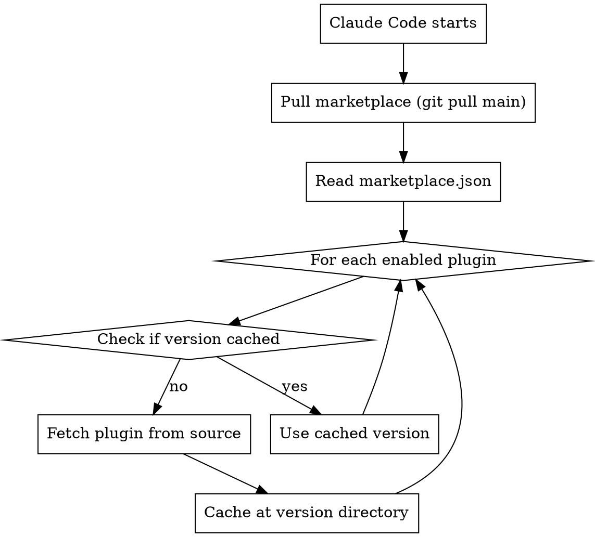

# Managing Marketplaces

## Overview

Plugin marketplaces are catalogs of available plugins. This skill covers how updates work, caching, and versioning.

## Key Locations

| Path | Purpose |
|------|---------|
| `~/.claude/plugins/marketplaces/` | Git clones of remote marketplaces |
| `~/.claude/plugins/cache/<marketplace>/<plugin>/<version>/` | Cached plugin versions |
| `~/.claude/plugins/known_marketplaces.json` | Marketplace registry with update timestamps |

## Update Mechanism

### Marketplace Level (No Version Pin)

Marketplaces track **main branch HEAD** - no commit pinning:

```json
// known_marketplaces.json
{
  "superpowers-marketplace": {
    "source": {
      "source": "git",
      "url": "https://github.com/obra/superpowers-marketplace.git"
    },
    "lastUpdated": "2026-01-09T15:25:06.447Z",
    "autoUpdate": true
  }
}
```

- `autoUpdate: true` pulls latest on startup/refresh

### Plugin Level (Version Pinned)

Plugins ARE versioned via the `version` field in plugin.json:

```
~/.claude/plugins/cache/
├── superpowers-marketplace/
│   └── superpowers/
│       └── 4.0.3/           ← version from plugin.json
└── claude-plugins-official/
    └── hookify/
        └── e30768372b41/    ← commit hash for official plugins
```

### Update Flow



## Version Pinning Summary

| Layer | Pinned? | Update Mechanism |
|-------|---------|------------------|
| Marketplace | No (tracks main HEAD) | `autoUpdate: true` or `/plugin marketplace update` |
| Plugin | Yes (version field) | Bump version in plugin.json → new cache dir |

## Commands

```bash
# List known marketplaces
/plugin marketplace list

# Update marketplace metadata
/plugin marketplace update <marketplace-name>

# Add marketplace
/plugin marketplace add owner/repo              # GitHub
/plugin marketplace add ./local-path            # Local
/plugin marketplace add https://url.git         # Git URL

# Remove marketplace (also uninstalls plugins from it)
/plugin marketplace remove <marketplace-name>
```

## Local Development

### ccd CLI (Recommended)

For marketplaces with a CLI for managing symlinks, use it:

```bash
cd ~/projects/my-marketplace
pnpm install
pnpm ccd link activate    # Symlink all plugins (creates cache if needed)
pnpm ccd link review      # Check status
pnpm ccd link deactivate  # Remove symlinks
```

Run `pnpm ccd --help` for full documentation including path resolution diagrams.

**Workflow:**
1. Activate symlinks: `pnpm ccd link activate` (no install required)
2. Develop: edit source, restart CC to see changes
3. Relink after any `claude plugin install` (overwrites symlinks)

### Manual Symlink Method

For marketplaces without the CLI, manually replace cache with symlinks.

**Key insight:** Cache path uses marketplace's `name` field from marketplace.json, not the source (GitHub vs local). So `~/.claude/plugins/cache/<name>/...` is the same whether you installed from GitHub or local path.

```bash
# 1. Clone repo locally (if not already)
git clone https://github.com/owner/marketplace ~/projects/my-marketplace

# 2. If not installed, add and install (skip if already from GitHub)
claude plugin marketplace add ~/projects/my-marketplace
claude plugin install my-plugin@my-marketplace

# 3. Replace cache with symlink (works for GitHub or local installs)
rm -rf ~/.claude/plugins/cache/<marketplace-name>/my-plugin/*/
ln -s ~/projects/my-marketplace/plugins/my-plugin \
      ~/.claude/plugins/cache/<marketplace-name>/my-plugin/<version>
```

**Caveats:**
- Reinstall overwrites symlink - re-run step 3 after any install
- Session-based reload, not hot-reload in same session

**Why this works:** CC loads plugins from cache path. Symlink makes cache path point to source. CC follows symlinks transparently.

### Standard Method

[Official docs](https://docs.claude.com/en/docs/claude-code/plugins#test-your-plugins-locally) show uninstall/reinstall cycle:

```bash
/plugin uninstall my-plugin@my-marketplace
/plugin install my-plugin@my-marketplace
```

## Enabling Plugins

In project or user `settings.json`:

```json
{
  "enabledPlugins": {
    "plugin-name@marketplace-name": true
  }
}
```

## Creating Plugins in a Marketplace

**CRITICAL**: When creating a new plugin, you MUST do BOTH:

1. Create the plugin directory with `plugin.json`
2. Register the plugin in `marketplace.json`

```
marketplace/
├── .claude-plugin/
│   └── marketplace.json    ← MUST add entry here
└── plugins/
    └── new-plugin/
        └── plugin.json     ← AND create this
```

**Failure mode**: Creating only the directory results in `/doctor` errors like:
```
Plugin new-plugin not found in marketplace marketplace-name
```

### Checklist for New Plugin

- [ ] Create `plugins/<name>/plugin.json` with name, version, description
- [ ] Add entry to `.claude-plugin/marketplace.json` plugins array
- [ ] Entry must include: `name`, `source` (e.g., `"./plugins/<name>"`), `description`
- [ ] Run `/doctor` to verify no plugin errors

## Notes

- Removing a marketplace uninstalls all plugins from it
- Multiple versions can coexist in cache (old versions not auto-cleaned)
- `lastUpdated` timestamp tracks when marketplace was last refreshed
