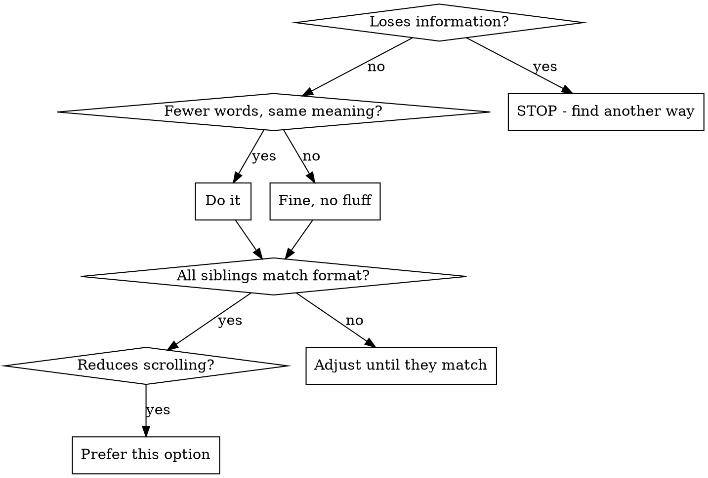

# Compact Mode

## Use Cases

- Reformatting research documents before flushing
- Converting verbose documentation to scannable lists
- Standardizing formatting across docs

## Examples

**Before** (verbose with headers):

```markdown
## How to Configure

The configuration file is located in the root directory. You need to
edit this file to change settings.

## Steps

1. First, open the file
2. Then, find the setting you want to change
3. Finally, save and restart
```

**After**:

```markdown
- **Configuration**
  - Location — `config.json` in root directory
  - Steps
    1. Open the file
    2. Find and modify target setting
    3. Save and restart
```

**Before** (sparse headings):

```markdown
### Foo

abc

### Bar

def
```

**After**:

```markdown
- **Foo:** abc
- **Bar:** def
```

## Preserving Content

**Compact mode is a formatting change, NOT a content reduction.** Nested lists support code blocks, tables, blockquotes, and sub-lists — all content from heading-based versions MUST appear in compact versions.

````markdown
<!-- WRONG: Lost the code block -->

- **Setup:** Configure the service
- **Logic:** Find users, delete records

<!-- RIGHT: Code block preserved via nesting -->

- **Setup:** Configure the service
  ```typescript
  const config = { ... };
  ```
- **Logic:**
  1. Find users by pattern
  2. Delete records
  ```typescript
  await prisma.user.deleteMany({ where: { email: { contains: pattern } } });
  ```
````

## Decision Tree



## Priority Order

Never sacrifice a higher priority for a lower one:

1. **Meaning** — preserve all facts, relationships, nuance
2. **Local consistency** — all siblings in a group MUST follow same pattern
3. **Information density** — less scrolling, easier to maintain context
4. **Point-form skeleton** — content in nested lists, not prose paragraphs

## Formatting Rules

| Rule             | Guidance                                                          |
| ---------------- | ----------------------------------------------------------------- |
| Section titles   | Bold, numbered (sequential) OR bulleted (parallel)                |
| One-liner format | `- **Title** — description` IF all siblings match                 |
| Code blocks      | Nest under list items, indent to align with parent text           |
| Em-dash (—)      | Inline descriptions (cleaner than colons)                         |
| Arrow (→)        | Simple A→B mappings only; use vertical lists for 3+ item chains   |
| Tables           | Use for truly tabular (multi-column) data, not nested under lists |
| Blank lines      | None between list items (breaks list continuity)                  |
| Backticks        | Commands (`npm run`), code terms — NOT file paths (kills editor clickability) |
| Imperative voice | "Run X" not "You should run X" — sentence fragments fine          |
| Footnotes        | `[1]` references for long URLs/citations — keeps flow clean       |
| Columnar layout  | Side-by-side comparisons (tables) vs sequential prose             |
| Glossary         | Define abbreviations at top in backticks, use short form after    |

## Anti-patterns

- `**Title:** desc` when siblings are multi-line — breaks consistency
- Prose paragraphs between list items — keep everything in list structure
- Multiple `##`/`###` headers
- Removing context "to be concise" — that's lossy, not succinct

## Inline Arrows vs Sublists

**Hard to parse:**

```markdown
- `npx <cmd>` → local node_modules → `~/.npm-global` → downloads
```

**Easier to parse:**

```markdown
- **npx fallback chain**
  1. local `node_modules`
  2. `~/.npm-global`
  3. downloads
```

Sequential info (3+ items) should be vertical with clear ordering, not horizontal arrows.

## Rationale

- Reduces vertical whitespace
- Improves scannability
- Keeps related information visually grouped
- Better for reference documents, checklists, and specs

## Notes

- Frequent format switching creates cognitive load
- Fix content structure first, then formatting becomes straightforward
