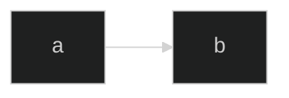
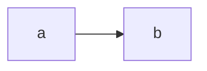
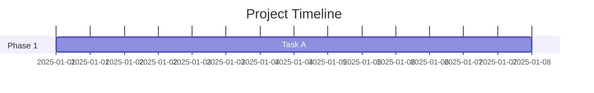
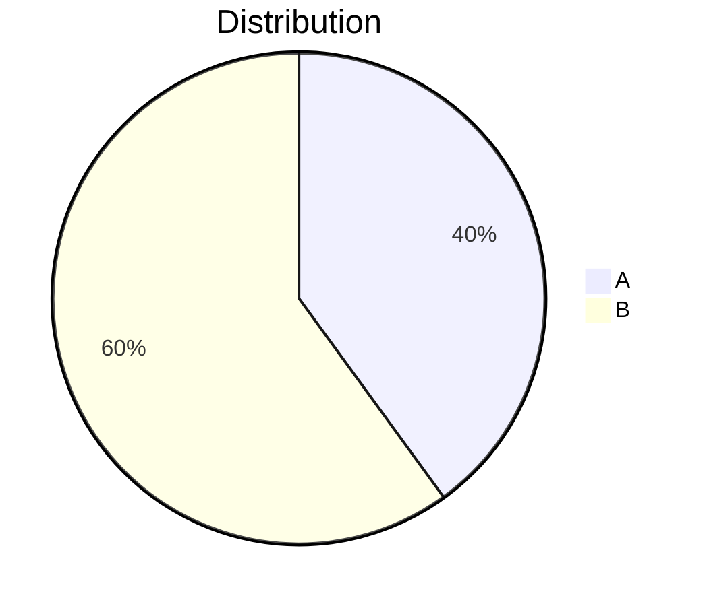

# Mermaid Directives Reference

Directives modify diagram behavior before rendering. Place them at the start of your diagram.

## Accessibility Directives

Work on **all diagram types**.

### accTitle (Accessibility Title)

Single-line title added to SVG `<title>` element.

```mermaid
accTitle: User Authentication Flow
flowchart LR
    login --> validate
```

### accDescr (Accessibility Description)

Single-line:

```mermaid
accDescr: Shows the login validation process
flowchart LR
    login --> validate
```

Multi-line (no colon, uses braces):

```mermaid
accDescr {
    This diagram shows the complete
    user authentication flow including
    validation and error handling.
}
flowchart LR
    login --> validate
```

## Configuration Directive

### %%{init}%%

Override theme, fonts, and diagram-specific settings.



**Top-level options:**

| Option        | Values                               |
| ------------- | ------------------------------------ |
| theme         | default, base, dark, forest, neutral |
| fontFamily    | Any CSS font-family                  |
| logLevel      | debug, info, warn, error, fatal      |
| securityLevel | strict, loose, antiscript, sandbox   |

**Diagram-specific options** (nested under diagram type):



## Diagram-Specific Title

Some diagram types have a `title` keyword (not a directive, but diagram syntax):

### Gantt



### Pie



## Comments

Use `%%` for comments (ignored by parser):


## Frontmatter Alternative

As of v10.5.0, you can use YAML frontmatter instead of `%%{init}%%`:


