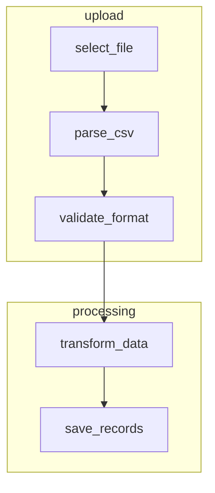

# Mermaid Style Guide

Mermaid diagrams should be **readable in raw form**, not just when rendered. The source code _is_ documentation.

## Node IDs

**Self-documenting snake_case names.** The ID _is_ the label.

```mermaid
%% GOOD - ID is the label
parse_csv --> validate_schema

%% BAD - redundant label
A[Parse CSV] --> B[Validate Schema]
```

**Prefix-position naming** for visual grouping in raw text:

```mermaid
%% Related nodes sort together visually
status_duplicate_email
status_missing_in_stripe
status_no_payment_method
status_create_subscription

action_create_account
action_update_user
action_set_payment_method
```

**Use labels only when necessary** - for shapes that need them or when ID would be too long:

```mermaid
%% Stadium shape needs content
start_import([start_import])

%% Diamond decisions can use short IDs
is_valid{is_valid}
has_payment{has_payment}
```

## Edge Labels

**Short snake_case** for branch conditions:

```mermaid
%% GOOD
is_valid -->|yes| process_data
is_valid -->|no| show_error

%% BAD - verbose
is_valid -->|Yes, the data is valid| process_data
```

## Subgraphs

**Descriptive snake_case names** that describe the phase/domain:

```mermaid
subgraph validation[validation]
    check_email --> check_stripe --> check_payment
end

subgraph execution[execution]
    create_records --> call_stripe_api
end
```

## Formatting

**Consistent indentation** within subgraphs:



**Group related edges** with blank lines for visual separation:

```mermaid
%% Input paths
csv_format -->|stripe| parse_stripe_format
csv_format -->|custom| parse_custom_format

%% Convergence
parse_stripe_format --> normalize_data
parse_custom_format --> normalize_data

%% Output
normalize_data --> validate
```
