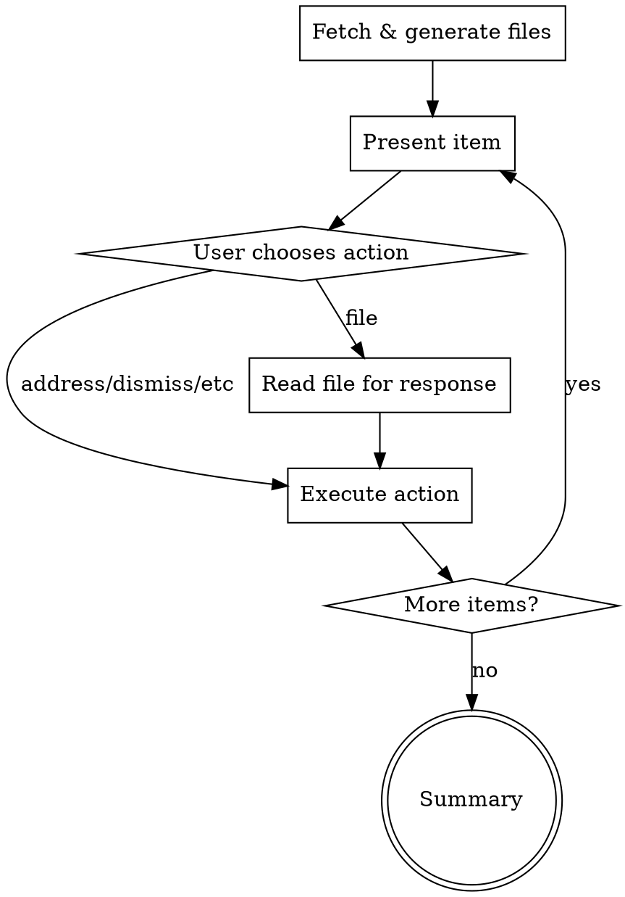
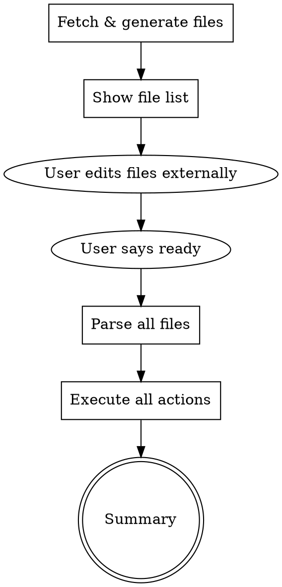

# Resolve Review

Process PR review feedback through file-based workflow with user control.

## Glossary

| Term       | Definition                                                     |
| ---------- | -------------------------------------------------------------- |
| **Thread** | GitHub review comment thread (atomic unit on GitHub)           |
| **Item**   | Unit of work - single thread, grouped threads, or comment part |
| **Part**   | Distinct feedback point within a multi-point PR comment        |

See [item-model.md](item-model.md) for complete schema.

## Usage

```bash
# Start review session (prompts for mode)
/resolve-review

# Start with specific PR
/resolve-review --pr=123

# Filter by author
/resolve-review --author=copilot

# Resume/apply from previous session
/resolve-review --apply --dir=<tmp>/owner-repo/123/2026-01-16
```

## Arguments

| Argument        | Description                                      |
| --------------- | ------------------------------------------------ |
| `--pr=N`        | PR number (default: current branch's PR)         |
| `--author=NAME` | Filter by author (case-insensitive)              |
| `--self`        | Include own comments (default: exclude)          |
| `--apply`       | Skip to apply phase (requires `--dir`)           |
| `--dir=PATH`    | Item files directory (for resuming batch session)|

## Workflow

### Mode Selection

At start, prompt user to choose mode:

```
How would you like to work through the review items?

[ ] Interactive - I'll present each item, you decide in-session (can defer to file)
[ ] Batch - I'll generate all files, you edit externally, then tell me when ready
```

### Interactive Mode



1. Fetch and generate all item files upfront
2. For each item:
   - Present item with analysis (per [terminal-view.md](terminal-view.md))
   - User chooses: address / dismiss / prior-fix / defer / **file**
   - If **file**: User edits the item's .md file, tells CC when ready, CC reads file for response
   - Execute action, move to next
3. Show summary

**"file" option**: Defers response to the file. User edits response yaml in their editor, returns to CC and says "ready" or "done". CC reads the file and uses whatever response is configured.

### Batch Mode



1. Fetch and generate all item files
2. Display file list with directory path
3. User edits files in their editor (modify responses, set `enabled: false`, delete files)
4. User returns and says "ready" / "apply" / "done"
5. Parse all remaining files via [scripts/files-to-items.sh](scripts/files-to-items.sh)
6. Execute all actions via [scripts/apply-items.sh](scripts/apply-items.sh)
7. Show summary

### File Generation

Both modes generate files upfront:

1. Fetch via [scripts/fetch-pr-items.sh](scripts/fetch-pr-items.sh)
2. Analyze each item and populate analysis section
3. Generate files via [scripts/items-to-files.sh](scripts/items-to-files.sh)

Output directory: `<tmp>/<owner>-<repo>/<pr>/<date>/`

File format: [file-view.md](file-view.md)

## Actions

| Action      | Code change | Thread closed | Meaning                       |
| ----------- | ----------- | ------------- | ----------------------------- |
| `address`   | Yes         | Yes           | Valid feedback, implement fix |
| `dismiss`   | No          | Yes           | Invalid/out-of-scope          |
| `prior-fix` | No          | Yes           | Already fixed earlier         |
| `defer`     | No          | No            | Handle manually later         |

## Reply Tone

Replies post from user's GitHub account. Keep them:

- Brief (1-2 sentences)
- Direct and factual
- No AI pleasantries
- No hedging

Examples:

- "Fixed in abc123."
- "Moved early return above the selector call."
- "Out of scope for this PR, tracking in HEA-1234."

## Critical Rules

1. **User controls timing** - Generate creates files, Apply executes (separate steps)
2. **File is source of truth** - User edits override CC analysis
3. **enabled: false skips** - Don't delete files to preserve context
4. **Defer = thread stays open** - No GitHub changes

## Reference

- [item-model.md](item-model.md) - Item schema (source of truth)
- [file-view.md](file-view.md) - Markdown file format
- [terminal-view.md](terminal-view.md) - Terminal display format
- [api-reference.md](api-reference.md) - GitHub GraphQL API
- [scripts/](scripts/) - Bash scripts for fetch/serialize/apply
