# Mermaid Syntax Reference

## Flowcharts

### Basic Structure

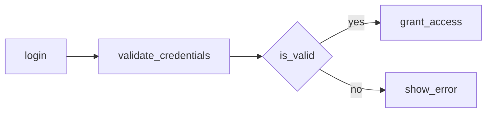

### Directions

* `LR` - Left to Right
* `TD` or `TB` - Top Down / Top to Bottom
* `RL` - Right to Left
* `BT` - Bottom to Top

### Node Shapes

| Syntax     | Shape             | Use For            |
| ---------- | ----------------- | ------------------ |
| `[Text]`   | Rectangle         | Processes, steps   |
| `(Text)`   | Rounded rectangle | Start/end          |
| `{Text}`   | Diamond           | Decisions          |
| `[(Text)]` | Cylinder          | Databases          |
| `([Text])` | Stadium           | Events             |
| `[[Text]]` | Subroutine        | External processes |
| `((Text))` | Circle            | Connectors         |

### Subgraphs

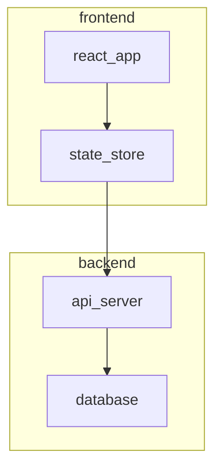

## Sequence Diagrams

### Basic Structure

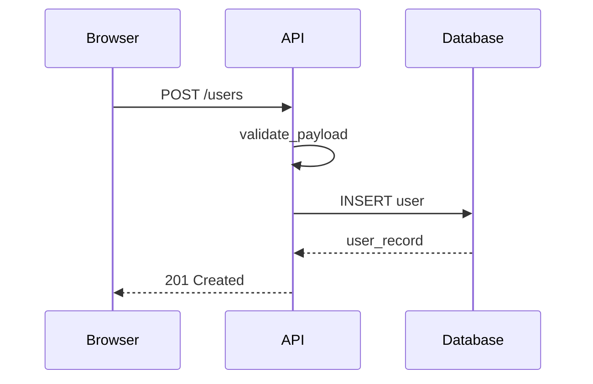

### Arrow Types

| Syntax | Meaning                       |
| ------ | ----------------------------- |
| `->`   | Solid line without arrow      |
| `-->`  | Dotted line without arrow     |
| `->>`  | Solid line with arrow         |
| `-->>` | Dotted line with arrow        |
| `-x`   | Solid line with cross (async) |
| `--x`  | Dotted line with cross        |

### Notes and Activations

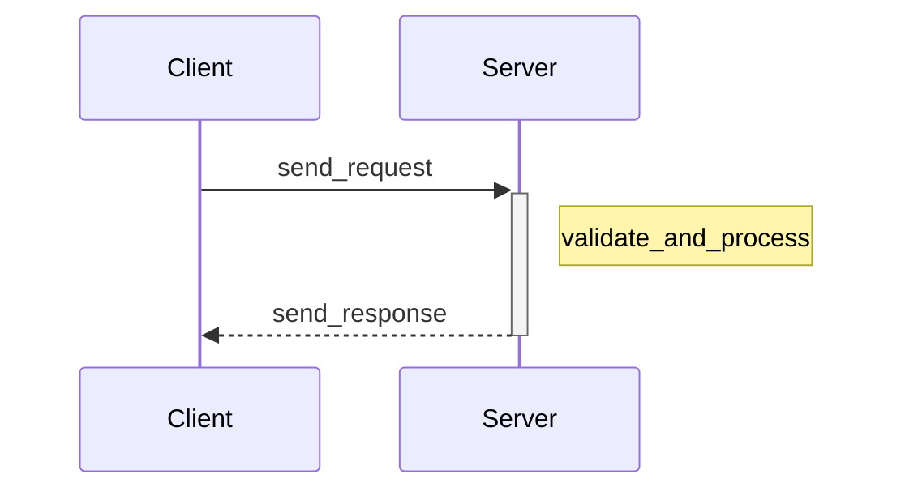

### Loops and Alternatives

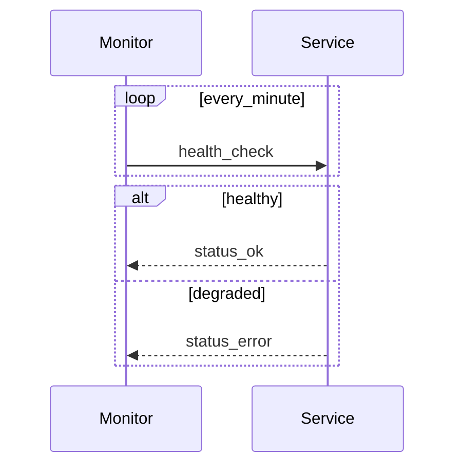

## State Diagrams

### Basic Structure

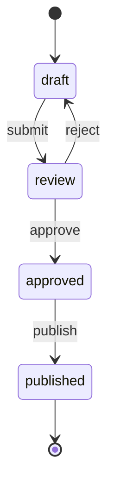

### Composite States

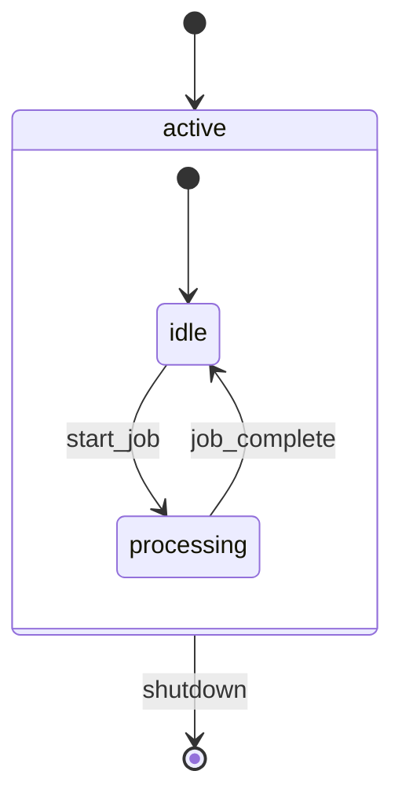

## Class Diagrams

### Basic Structure

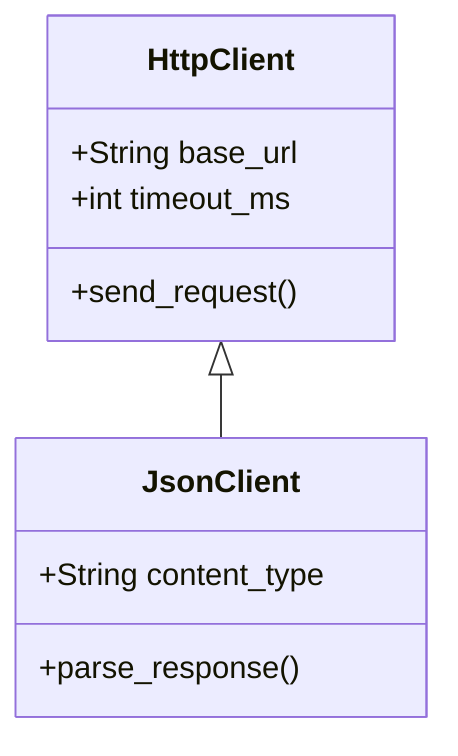

### Relationships

| Syntax  | Meaning     |
| ------- | ----------- |
| `<\|--` | Inheritance |
| `*--`   | Composition |
| `o--`   | Aggregation |
| `-->`   | Association |
| `..>`   | Dependency  |
| `..\|>` | Realization |

## Gantt Charts

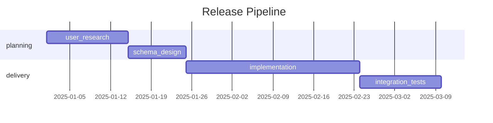

## Entity Relationship

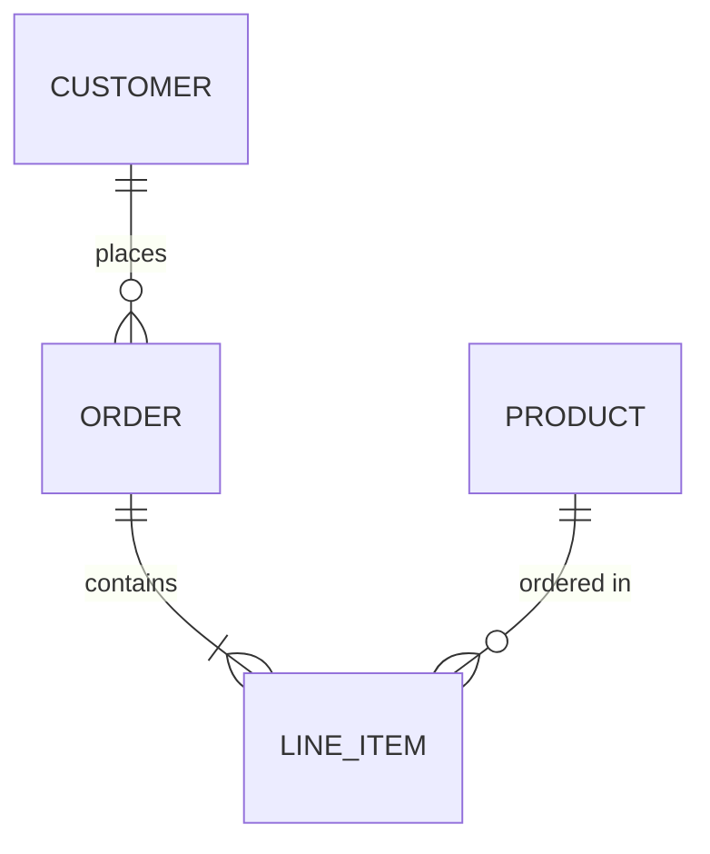

### Relationship Syntax

| Syntax | Meaning      |
| ------ | ------------ |
| `\|\|` | Exactly one  |
| `o\|`  | Zero or one  |
| `}o`   | Zero or more |
| `}\|`  | One or more  |

## Styling

### Node Colors

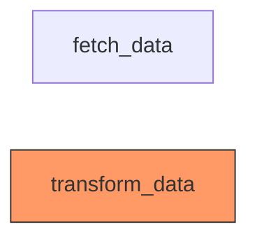

### Link Styles

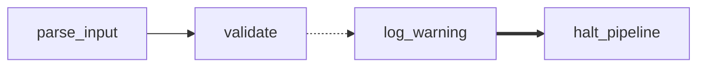

* `-->` Solid arrow
* `-.->` Dotted arrow
* `==>` Thick arrow
