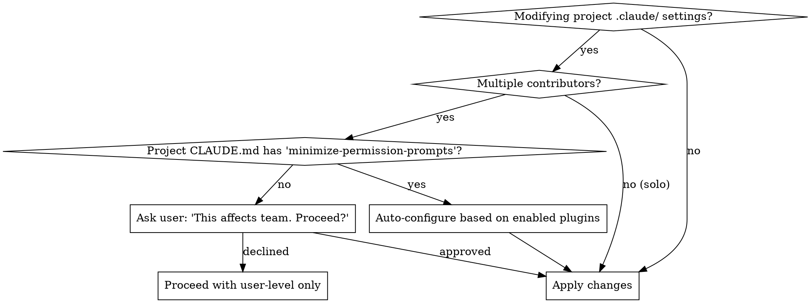

# Team vs Solo Project Detection

## Check Contributor Count

```bash
git shortlog -sne --all | head -10
```

## Decision Flow



## Project Preference

Add to project CLAUDE.md to enable auto-configuration:

```markdown
## Permissions
* minimize-permission-prompts: true
```

## Auto-Configuration Logic

When `minimize-permission-prompts: true` is set:

1. Read `.claude/settings.json` for `enabledPlugins`
2. Generate `Skill(plugin-name:*)` pattern for each enabled plugin
3. Add to `.claude/settings.local.json` (or committed settings if team shares)
4. Remember: `Skill(*)` doesn't work in project settings — must list individually
